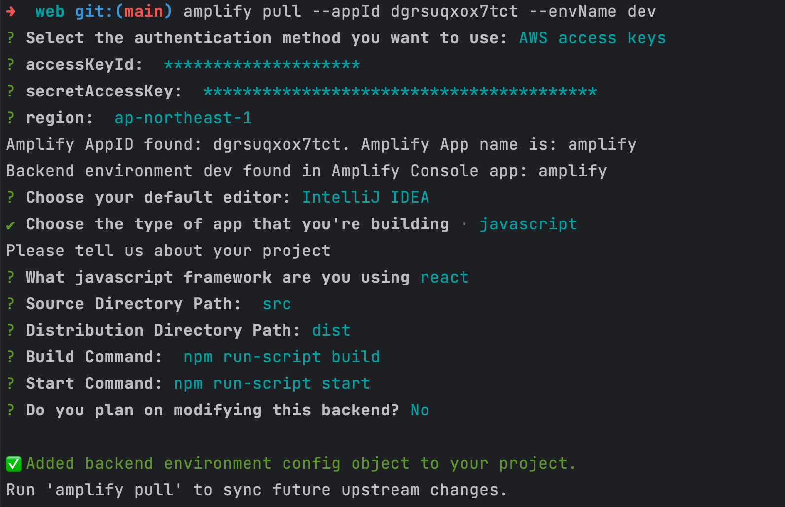

# React-Memo-App
A note-taking app which supports Markdown syntax, built with React + Typescript + AWS amplify.


## How to run the app locally
You need to have an **AWS account** to run amplify backend locally with the frontend.

### Installation

First, clone this repository:

<!-- start:code block -->
```
git clone https://github.com/XuqiuyeLi/React-Memo-App.git
cd web
```

Install dependencies:
```
cd web
npm install
```

### Configure AWS amplify
Install Amplify CLI (skip it if you already have Amplify CLI installed):
```
npm install -g @aws-amplify/cli
```
Configure Amplify backend to run with the app:
```
# you have to have an aws account to continue using Amplify locally
# make sure you are inside /web directory
amplify configure
```
You can follow the article [here](https://docs.amplify.aws/javascript/tools/cli/start/set-up-cli/#configure-the-amplify-cli) to finish configuring amplify CLI.

### Set up amplify backend locally
```
amplify pull --appId dgrsuqxox7tct --envName dev

# use the AWS Amplify user credentials you set up when configuring with Amplify CLI to access the backend
```
Here is a sample what result should look like when using AWS access key to pull the app:



### Run the app
```
npm run dev
```

Open http://localhost:5173/ in your browser, now you can create, edit, delete notes!
<!-- end:code block -->

## Check out the app at the deployed url
I have deployed the app to AWS amplify, you can also check it out [here](https://dev.dgrsuqxox7tct.amplifyapp.com)
